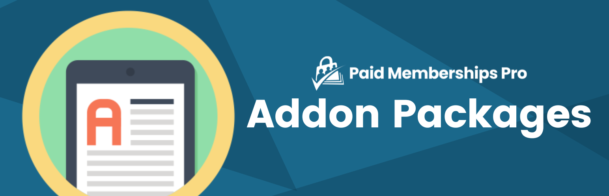

# [Addon Packages: Purchase Access to a Page, Post or “Thing”](https://www.paidmembershipspro.com/add-ons/pmpro-purchase-access-to-a-single-page/) #
[comment]: # (Generate badges from shields.io, only works for .org plugins to get other stats etc. We'd have to create our own endpoints for Premium plugins)

### Welcome to the Addon Packages GitHub Repository
Sell access to individual pages or posts, or sell a la carte items for a flat fee.

For more information please visit [paidmembershipspro.com/add-ons/pmpro-purchase-access-to-a-single-page](https://www.paidmembershipspro.com/add-ons/pmpro-purchase-access-to-a-single-page/)

## Installation ##
For detailed installation steps, visit the [documentation](https://www.paidmembershipspro.com/add-ons/pmpro-purchase-access-to-a-single-page/) page.

1. Download the current development ZIP file directly: `https://github.com/strangerstudios/pmpro-addon-packages/archive/dev.zip`

**Please ensure that once installing this version of the plugin to remove `-dev` from the plugin's folder name.**

## Bugs ##
If you find an issue/bug, let us know by [creating a detailed GitHub issue](https://github.com/strangerstudios/pmpro-addon-packages/issues/new).

## Support ##
This is a developer's portal for Addon Packages. We do not offer support on this channel. 
**Any support related questions should be directed to [paidmembershipspro.com/support](https://www.paidmembershipspro.com/support/).**

## Contributing to Addon Packages ##
We encourage and welcome any contribution to Addon Packages. Please read the [guidelines for contributing](https://github.com/strangerstudios/pmpro-addon-packages/blob/dev/.github/CONTRIBUTING.md) to this repository.

There are various **ways to the help development** of Addon Packages:

1. Report [bugs/issues](https://github.com/strangerstudios/pmpro-addon-packages/issues/new) on GitHub.
2. Work on any issues by submitting a Pull Request.

Here are some ways for **non-developers to contribute** to Addon Packages:

1. Translate Addon Packages into your own [language](https://www.paidmembershipspro.com/paid-memberships-pro-in-your-language/).
2. [Purchase a paid membership](https://paidmembershipspro.com/pricing) to help fund ongoing development and bug fixes.
3. Leave an honest review for [Addon Packages](https://www.paidmembershipspro.com/submit-testimonial/).